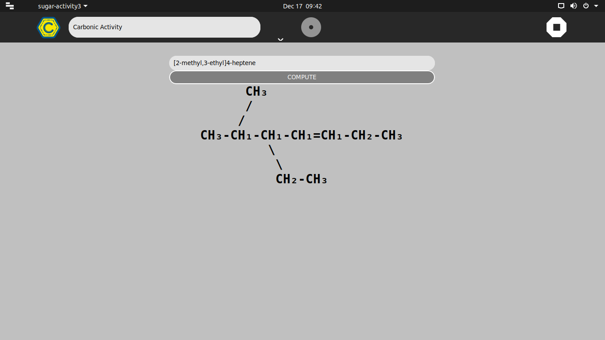
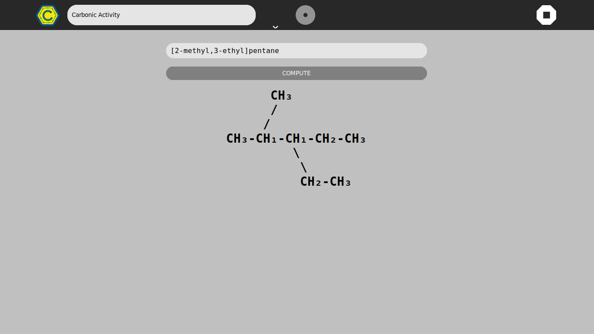
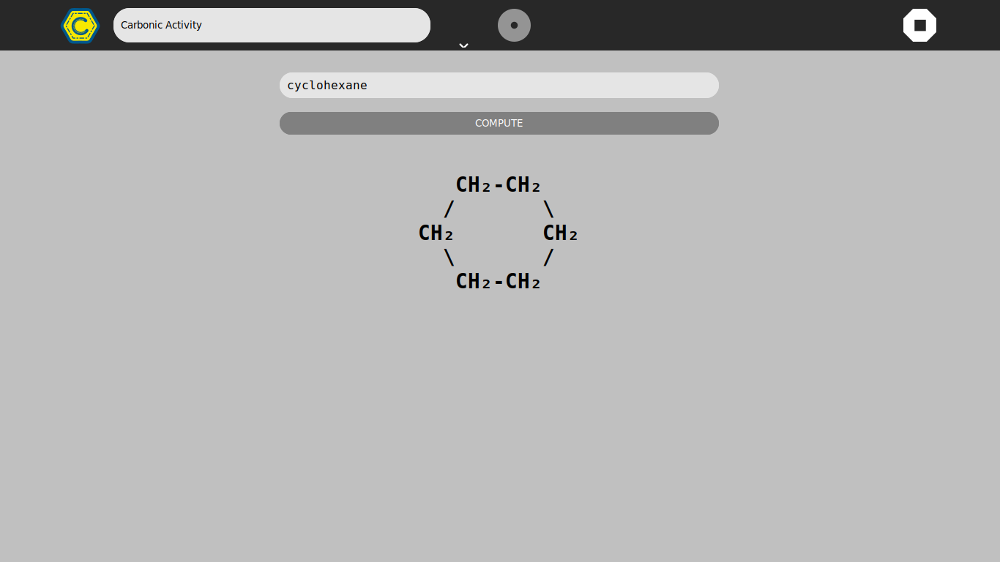

# carbonic-activity (r1)
A sugar activity derived from [carbonic](https://github.com/srevinsaju/carbonic)
which manipulates IUPAC name of Hydrocarbons, to define the structural formula.
It helps students to understand the various IUPAC name nomenclature in carbon 
structure

# Installation
* Clone the source
```git clone https://github.com/srevinsaju/carbonic-activity.git ~/Activities/Carbonic.activity```
TODO: 
* Release a flatpak package

# Screenshots





# Features
Refer [carbonic](https://github.com/srevinsaju/carbonic) for more information


